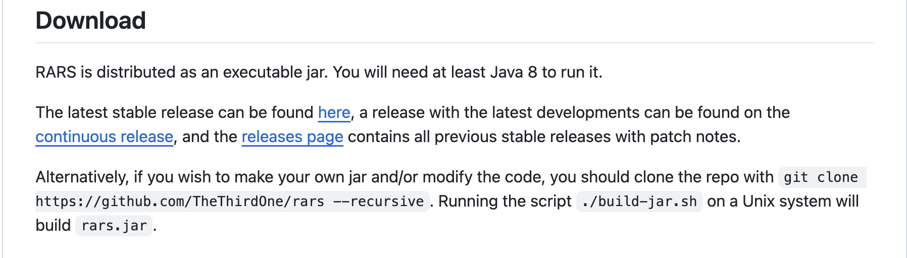

# Baixar Rars
Como baixar o rars para rodar RISC-V

#### 1. link
Entrar no link
https://github.com/TheThirdOne/rars

#### 2. downloads
Ir em downloads
https://github.com/TheThirdOne/rars/releases/tag/v1.6

**Se o link não funcionar:** 

ir no READme

Ir em downloads

Clicar em **here**


<p>
  
</p>

#### 3. baixar rars1_6.jar

baixar o arquivo **rars1_6.jar** disponivel no final da pagina

(ou outra versão)

#### 4. abrir no mac


**1. ir em privacidad y seguridad**

permitir o aplicativo

**2. clicando**

clicar duas vezes no app e ele vai abrir

**2. terminal**

rodar 
```java -jar rars1_6.jar```

tem que estar na mesma pagina que o arquivo ta!